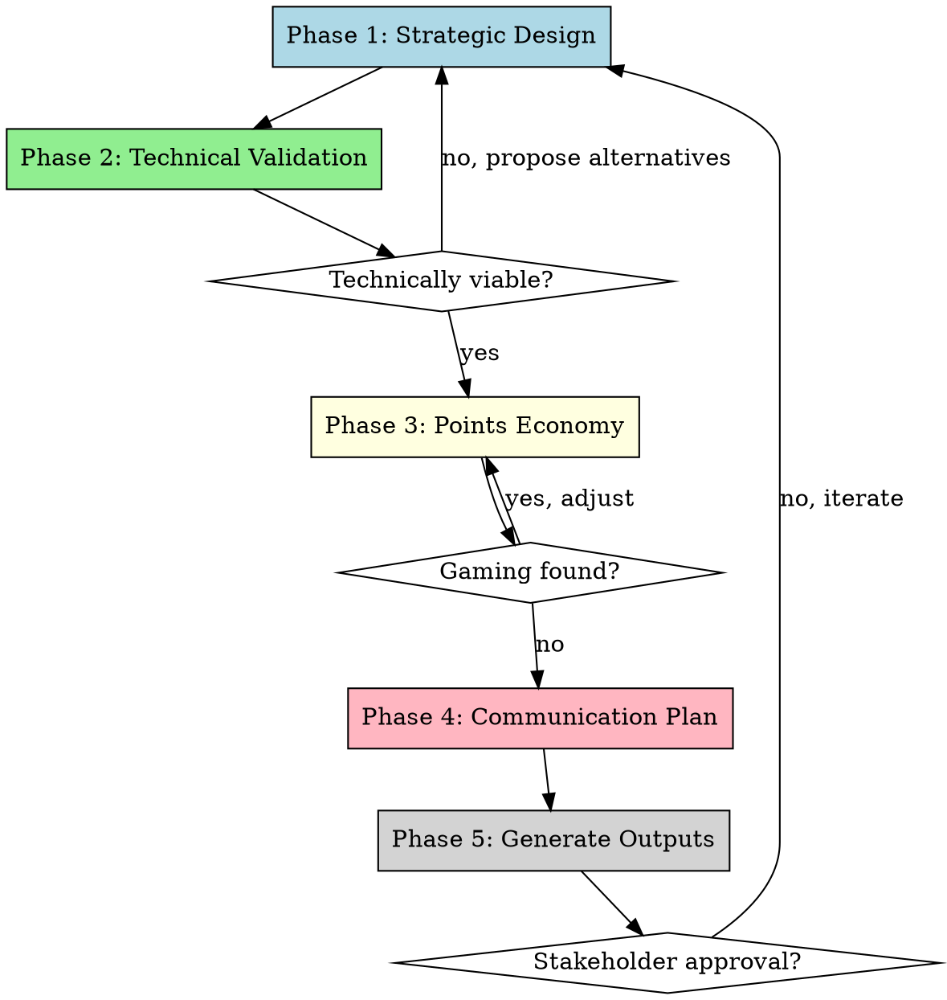

# Challenge Design Workshop

## Overview

**End-to-end framework for designing balanced challenges** from strategic concept to technical implementation. Iteratively validates technical viability at each step while designing points economy that incentivizes desired behavior without creating gaming opportunities.

**Core principle:** Great challenges align strategic objectives with technical capabilities and economic balance.

## When to Use

Use when:
- Designing new challenge from scratch (sponsor activation, fan engagement, event promotion)
- Validating/refactoring existing challenge configuration
- Need to justify challenge design to stakeholders/sponsors
- Translating business ideas into technical specifications
- Exporting tools/specs for business team and developers

Don't use for:
- Simple one-off promotions (no ongoing mechanics)
- Challenges with <3 action types
- Systems without points/scoring (pure participation tracking)

## Red Flags - STOP and Use Framework

These thoughts mean you're skipping critical steps:

- "Just need quick point numbers" without understanding challenge objective
- "Based on effort/value" without defining metrics
- "Users won't game it" without simulating rational actor
- Proposing mechanics without checking technical viability
- Assigning points before validating gaming vulnerabilities
- Skipping communication plan ("marketing will figure it out")

**All of these mean: Follow the 5-phase framework systematically.**

## The Framework



### Phase 1: Strategic Design

Define challenge objectives and mechanics BEFORE touching technical details.

**Step 1.1: Challenge Objective** (use AskUserQuestion with multiple choice)

What's the primary goal?
- **A) Sponsor Activation** - Drive engagement with specific sponsor/brand
- **B) Fan Engagement** - Maximize community participation and content creation
- **C) Event Promotion** - Build buzz for upcoming match/event
- **D) Revenue Generation** - Drive purchases/conversions
- **E) Mixed** - Combination of above (specify priorities)

**Step 1.2: Challenge Theme & Duration**

Ask user:
- Theme/name of challenge (e.g., "Pre-Match Hype Challenge", "Sponsor X Fan Showcase")
- Start and end dates (timezone: UTC)
- Is this one-time or recurring series?

**Step 1.3: Desired Mechanics**

What actions should earn points?
- Instagram engagement (comments, posts with hashtag, stories with mention)
- Purchases (sponsor products, team merchandise)
- Referrals (bring new members)
- Interactive content (polls, trivia, surveys)
- Offline actions (event attendance, in-store validation)
- Other (user specifies)

Get complete list upfront - don't design piecemeal.

**Step 1.4: Target Audience & Scale**

Ask:
- Who can participate? (all members, specific tier+, public)
- Expected participation scale (10s, 100s, 1000s of users)
- Volume targets (e.g., "want 200 posts/month")

**Output: Strategic brief (markdown)**
```markdown
## Challenge: [Name]
**Objective:** [Primary goal with success criteria]
**Duration:** [Dates]
**Target Audience:** [Who participates]
**Desired Actions:** [List of proposed mechanics]
**Success Metrics:** [What defines success]
```

### Phase 2: Technical Validation

Validate EACH proposed mechanic against current system capabilities. Block if not viable, propose alternatives.

**Step 2.1: Check Detection Capabilities**

For each proposed action, verify:

1. **Read system enums** - Check `app/models/tables/challenges.py`:
   ```python
   class ChallengeActionType(str, Enum):
       IG_COMMENT = "ig_comment"
       IG_TOP_COMMENT = "ig_top_comment"
       IG_POST_HASHTAG_MENTION = "ig_post_hashtag_mention"
       IG_STORY_MENTION = "ig_story_mention"
       PURCHASE_SPONSOR = "purchase_sponsor"
       PURCHASE_CHILERUGBY = "purchase_chilerugby"
       SIDE_QUEST = "side_quest"
       OFFLINE_EVENT = "offline_event"
       POLL_COMPLETION = "poll_completion"
       TRIVIA_PARTICIPATION = "trivia_participation"
       TRIVIA_PERFECT_SCORE = "trivia_perfect_score"
       TRIVIA_WINNER = "trivia_winner"
       REFERRAL = "referral"
   ```

2. **If action type exists**: ✅ Proceed
3. **If action type missing**: ❌ Block and propose alternatives

**Example Block:**
```
❌ Instagram Reactions are not currently detectable.

Viable alternatives for Instagram engagement:
1. IG Comments (✅ ChallengeActionType.IG_COMMENT)
2. IG Posts with hashtag (✅ ChallengeActionType.IG_POST_HASHTAG_MENTION)
3. IG Stories with mention (✅ ChallengeActionType.IG_STORY_MENTION)

Which would you prefer?
```

**Step 2.2: Check Validation Capabilities**

For approved action types, check what validations are supported:

1. **Read ChallengeActionRule fields** from `app/models/tables/challenges.py`:
   - instagram_account_ids (restrict to specific IG accounts)
   - min_comment_length
   - forbidden_words
   - required_hashtags
   - required_mentions
   - min_time_public_hours
   - sponsor_id (for purchase tracking)
   - sponsor_code_prefix
   - min_purchase_amount_cents

2. **Ask user which validations to apply** (use AskUserQuestion)

**Example:**
```
For IG_POST_HASHTAG_MENTION, which validations?
□ Require specific hashtags (e.g., #sponsorX)
□ Require specific mentions (e.g., @chilerugby)
□ Post must stay public for X hours (anti-delete)
□ Restrict to sponsor's Instagram account only
```

**Step 2.3: Check Sponsor Configuration** (if sponsor-related)

If challenge involves sponsor:
1. Ask user: "Which sponsor?" (list from DB or ask name)
2. **Verify sponsor exists** in `sponsors` table
3. **Check sponsor has required setup:**
   - Instagram account linked? (needed for instagram_account_ids validation)
   - Discount codes configured? (needed for purchase tracking)
   - Active benefits? (for benefit-gated challenges)

4. **If missing setup**: Warn user and document in output

**Output: Technical Feasibility Report (markdown)**
```markdown
## Technical Validation Results

### Approved Actions
- ✅ IG Posts with #sponsorX (ChallengeActionType.IG_POST_HASHTAG_MENTION)
  - Validations: required_hashtags=["#sponsorx"], min_time_public_hours=24
- ✅ Purchases (ChallengeActionType.PURCHASE_SPONSOR)
  - Validations: sponsor_id=3, min_purchase_amount_cents=1000000

### Blocked Actions
- ❌ Instagram Reactions (not supported)
  - Alternative: Use IG_COMMENT instead

### Sponsor Setup Required
- ⚠️ Sponsor "Sponsor X" (id=3) missing Instagram account linkage
  - Impact: Cannot restrict posts to sponsor's account
  - Workaround: Validate hashtag only
```

### Phase 3: Points Economy Design

Now design balanced point values for approved actions.

**Step 3.1: Gather Economic Context**

Ask user for (use AskUserQuestion for multiple choice when possible):

**Available Metrics**:
- Current engagement rates (Instagram followers, avg engagement)
- Commercial data (CAC, LTV, ticket size, profit margins)
- Volume targets from Phase 1 (posts/month, purchases/month)
- Existing point history (if applicable from previous challenges)

**Constraints**:
- Budget for rewards/redemptions (monthly point budget if applicable)
- Manual validation capacity (hours/week for quality checks)
- Anti-abuse limits (daily caps, rate limits)

**Step 3.2: Build Evaluation Matrix

Evaluate each action on 4 dimensions (1-10 scale):

**C - Community/Engagement Value**
- 1-3: Private/invisible (poll response, profile update)
- 4-6: Semi-public (comment, like)
- 7-10: Public reach (post with hashtag, story mention)

**E - Quality/Enforceability**
- 1-3: Easily automated/spammed (generic comments, fake follows)
- 4-6: Moderate quality checks possible (length, keywords)
- 7-10: Inherently high-quality (purchases, verified referrals)

**B - Business Value (Revenue)**
- 1-3: No direct revenue (likes, follows)
- 4-6: Indirect conversion potential (engagement → future purchase)
- 7-10: Direct revenue or high conversion (purchase, referral)

**F - Future Value (LTV)**
- 1-3: One-time action, no future signal (poll response)
- 4-6: Habit-forming (weekly engagement)
- 7-10: High LTV indicator (referral, premium purchase)

**Output: CSV table**
```
Action,C_Score,E_Score,B_Score,F_Score,Notes
ig_comment,5,3,2,4,"Semi-public but easily spammed"
ig_post_hashtag,8,6,5,6,"High reach, moderate quality check via hashtag"
purchase,2,10,10,8,"Private but verified, direct revenue"
referral,6,9,7,10,"Semi-public, verified, highest LTV"
poll,2,8,1,2,"Private, verified, no revenue"
trivia,3,9,3,3,"Private, verified, shows engagement"
```

**Step 3.3: Generate Recommendations**

Three modes available - pick based on stakeholder preference:

**Mode A: Relative Scaling** (simplest)
- Pick baseline action (usually lowest-value): "comment = 10 pts"
- Weight dimensions: `w_c * C + w_e * E + w_b * B + w_f * F`
- Default weights: Community=20%, Quality=20%, Business=35%, Future=25%
- Scale all actions proportionally

**Mode B: Economic Anchoring** (most defensible)
- Calculate economic value per action (revenue, CAC saved, etc.)
- Define conversion: `1 point = $X CLP economic value`
- Adjust by strategic multipliers (2x for priority actions)

**Mode C: Target-Based** (goal-oriented)
- Input monthly targets per action type
- Calculate point budget (total points to distribute)
- Allocate points to achieve target distribution

**Output: Recommendations table with 3 scenarios**
```
Action,Mode_A_pts,Mode_B_pts,Mode_C_pts,Recommended
ig_comment,10,8,12,10
ig_post_hashtag,45,35,50,40
purchase,150,200,100,150
referral,180,250,200,200
poll,8,5,8,8
trivia,15,12,15,15
```

**Step 3.4: Validate & Simulate**

**Gaming Detection:**
1. Calculate "point efficiency" = `points / (time_minutes + difficulty_1_to_10)`
2. Flag if spread >3x (easiest action gives >3x efficiency vs hardest)
3. Check spam scenarios: "100 comments/day = ? vs 1 purchase = ?"

**Rational Actor Simulation:**
Model user maximizing points with minimum effort:
- Time budget: 30min/day
- Actions sorted by efficiency
- Output: predicted action distribution

**Quality Checks:**
- Do high-revenue actions give most points? (if revenue is priority)
- Can users "farm" points faster than intended redemption rate?
- Are one-time high-value actions (referral) worth enough vs repeatable low-value?

**Output: Validation report (markdown)**
```markdown
## Gaming Vulnerabilities
- ⚠️ Comments (10pts/2min) = 5pts/min vs Purchase (150pts/60min) = 2.5pts/min
- Mitigation: Rate limit comments to 5/day OR reduce to 5pts each

## Rational Actor Behavior (30min/day budget)
With current config, optimal strategy:
1. 15 comments (150pts, 30min) - beats everything else
2. User NEVER purchases or posts

Recommended: Reduce comment to 5pts OR add daily cap
```

### Phase 4: Communication Plan

Design basic communication strategy for challenge launch and execution.

**Step 4.1: Pre-Launch (1 week before)**

Ask user:
- How will you announce the challenge? (Instagram, email, in-app notification)
- Target: All members or specific segment?

Suggest template copy:
```
🚀 Nuevo Challenge: [Name]
[Brief hook about theme]
📅 Fecha: [Start] - [End]
🎁 Gana puntos haciendo [key actions]
👉 [CTA]
```

**Step 4.2: Launch Day**

Recommend multi-channel push:
- Instagram feed post (template with visual suggestions)
- Email to active members
- In-app notification/banner

**Step 4.3: During Challenge**

Suggest cadence:
- Weekly reminder (mid-challenge)
- Highlight top participants (leaderboard tease)
- Address common questions (FAQ update)

**Step 4.4: Post-Challenge**

- Announce winners/results
- Share engagement stats
- Tease next challenge

**Output: Communication Brief (markdown)**
```markdown
## Communication Plan: [Challenge Name]

### Pre-Launch (Week of [date])
**Channels:** Instagram Stories, Email
**Message:** [Template copy]
**Target:** [Audience segment]

### Launch ([Start Date])
**Channels:** Instagram Feed, Email, In-app
**Assets needed:** [Visual specs]
**Copy:** [Template]

### Mid-Challenge ([Date])
**Reminder:** [Template]
**Leaderboard:** Share top 10

### Post-Challenge ([End Date])
**Winners announcement:** [Format]
**Stats to share:** [Metrics]
```

### Phase 5: Generate Complete Outputs

Export all deliverables for business team and developers.

**Output 1: Challenge Specification (markdown for stakeholders)**

```markdown
# Challenge: [Name]

## Strategic Overview
**Objective:** [From Phase 1]
**Duration:** [Dates]
**Target Audience:** [Segment]
**Success Metrics:** [KPIs]

## Approved Mechanics
[List of actions with validation rules]

## Points Economy
[Table with recommended points per action]
[Gaming mitigations applied]

## Communication Plan
[Timeline and templates from Phase 4]

## Next Steps
- [ ] Dev implements technical config
- [ ] Marketing creates assets
- [ ] Test challenge in staging
- [ ] Launch on [date]
```

**Output 2: Technical Specification (markdown for developers)**

```markdown
# Challenge Technical Spec: [Name]

## Challenge Configuration
- Name: [exact string]
- Description: [user-facing text]
- sponsor_id: [lookup in DB or NULL]
- start_at: [ISO 8601 datetime]
- end_at: [ISO 8601 datetime]
- status: "draft" (change to "active" on launch)

## Rules Configuration

### Rule 1: [Action Type]
- rule_type: [ChallengeActionType enum value]
- validation_type: "automated" | "manual" | "automated_then_manual"
- Validations:
  - [field]: [value]
  - [field]: [value]

### Rule 2: [Action Type]
[Same format]

## RuleChallenges to Create
- rule_id: [from existing or new rule above]
- challenge_id: [from created challenge]
- points_awarded: [from Phase 3]
- is_active: true

## Verification Checklist
- [ ] Test each action type triggers correctly
- [ ] Verify points awarded match spec
- [ ] Check gaming mitigations (rate limits, caps)
- [ ] Validate sponsor linkages (if applicable)
```

**Output 3: Analysis Tools (Excel/CSV)**

Generate using `points_economy_calculator.py`:
- Excel workbook with evaluation matrix, scenarios, gaming validation
- CSV with finalized action→points mapping
- Simulation results (predicted user behavior)

**Output 4: Presentation Deck (markdown)**

```markdown
# Challenge Proposal: [Name]

## The Opportunity
[Strategic objective and business case]

## How It Works
[Mechanics explained for non-technical audience]

## Expected Results
[Projections from simulation]

## Investment Required
[Budget, resources, timeline]

## Risks & Mitigations
[Gaming risks addressed, communication plan]

## Recommendation
[Go/No-Go with rationale]
```

## Implementation Pattern

```python
# Ask context questions
objectives = ask_multiple_choice(
    "Primary objective?",
    ["Engagement volume", "Revenue", "Community", "Mixed"]
)

# Build matrix with user input
matrix = evaluate_actions_with_user(action_list)

# Generate recommendations (all 3 modes)
recs_a = mode_relative_scaling(matrix, baseline_pts=10)
recs_b = mode_economic_anchoring(matrix, economic_data)
recs_c = mode_target_based(matrix, volume_targets)

# Validate
issues = detect_gaming(recs_a)
if issues:
    present_issues_and_iterate()

# Export
export_excel_workbook(matrix, recs_a, recs_b, recs_c, issues)
export_markdown_summary(objectives, methodology, recommendations)
```

## Common Mistakes

| Mistake | Fix |
|---------|-----|
| Skipping Phase 1 (jumping to points) | Understand objective BEFORE designing mechanics |
| Proposing mechanics without Phase 2 validation | Check technical viability - don't design unimplementable features |
| "Users won't game it" | ALWAYS simulate rational actor in Phase 3 - humans optimize |
| Skipping economic anchoring | Business needs defensible rationale, not intuition |
| Equal weights to all dimensions | Align weights with stated objectives from Phase 1 |
| One point mode only | Present 3 scenarios, let stakeholders choose |
| No communication plan | Marketing can't execute with just a technical spec |
| Forgetting to export tools | Business team needs Excel + markdown, not code |

## Rationalization Table

| Excuse | Reality |
|--------|---------|
| "Just need quick point numbers" | Points without strategy create misaligned incentives - follow 5 phases |
| "We'll figure out technical details later" | Phase 2 catches unimplementable ideas early - saves weeks of wasted planning |
| "Too complex for our simple challenge" | Simple challenges are EASIER to game - framework catches it |
| "Business team won't understand matrix" | Export Excel with examples - they'll understand trade-offs |
| "We can adjust points later" | Changing points post-launch destroys user trust - get it right in Phase 3 |
| "Framework is overkill for one challenge" | Ad-hoc design always has issues - 2hr investment saves months of fixes |
| "Marketing will figure out communication" | Phase 4 brief prevents launch delays and misaligned messaging |

## Real-World Impact

**Before framework (ad-hoc design):**
- "Let's do Instagram reactions challenge!" → Not detectable, wasted 2 weeks planning
- "Comments = 10pts felt right" → Users spam 50 comments/day, never purchase
- No communication plan → Marketing scrambles last minute, poor launch
- Had to reduce points 80% post-launch → Users revolt, lost trust

**After framework (5 phases):**
- Phase 2 caught "reactions not detectable" on Day 1 → Switched to viable mechanics
- Phase 3 detected gaming → Added daily cap + reduced comment value BEFORE launch
- Phase 4 communication brief → Marketing had 2 weeks prep, coordinated launch
- Phase 5 outputs → Dev implemented in 1 day from spec, stakeholders approved presentation
- **Result:** Achieved target distribution (60% engagement, 30% purchases, 10% referrals), no post-launch fixes needed

## Example: Sponsor Activation Challenge

**Phase 1 Output:**
```markdown
Challenge: "Sponsor X Fan Showcase"
Objective: Drive 200 Instagram posts with #sponsorX during March
Mechanics: Posts with hashtag, stories with mention, sponsor purchases
```

**Phase 2 Validation:**
- ✅ IG_POST_HASHTAG_MENTION supported
- ✅ IG_STORY_MENTION supported
- ✅ PURCHASE_SPONSOR supported
- ⚠️ Sponsor X missing Instagram account linkage → Cannot restrict to sponsor's account only
- **Decision:** Proceed with hashtag-only validation

**Phase 3 Economy:**
- Post with #sponsorX: 40 pts
- Story with @sponsorX: 25 pts
- Purchase: 150 pts
- Gaming check: Daily cap on posts (5/day) to prevent spam

**Phase 4 Communication:**
- Pre-launch: Instagram tease "Nuevo challenge con Sponsor X"
- Launch: Email + feed post + in-app banner
- Weekly: Leaderboard update

**Phase 5 Deliverables:**
- ✅ Markdown spec for stakeholders (approved by Sponsor X)
- ✅ Technical spec for dev (implemented in 1 day)
- ✅ Excel with point scenarios (business team has for reference)
- ✅ Communication templates (marketing executed on schedule)
